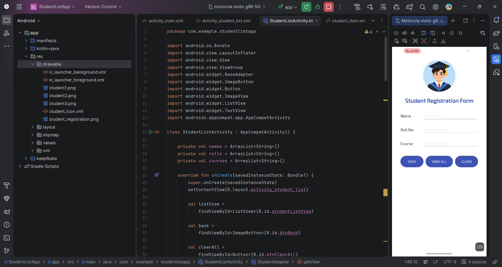
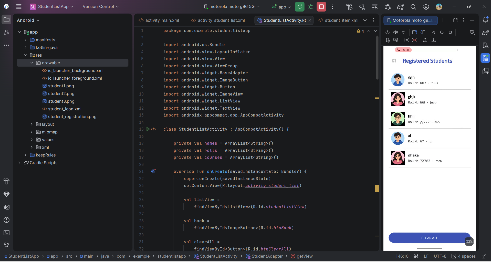
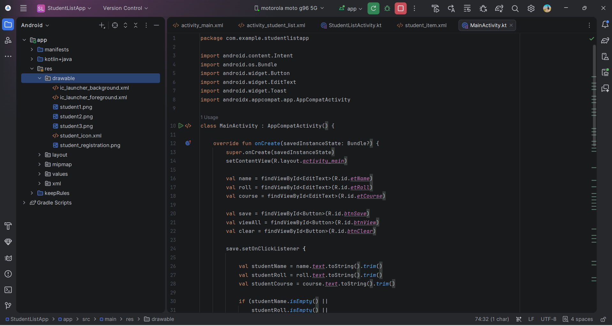
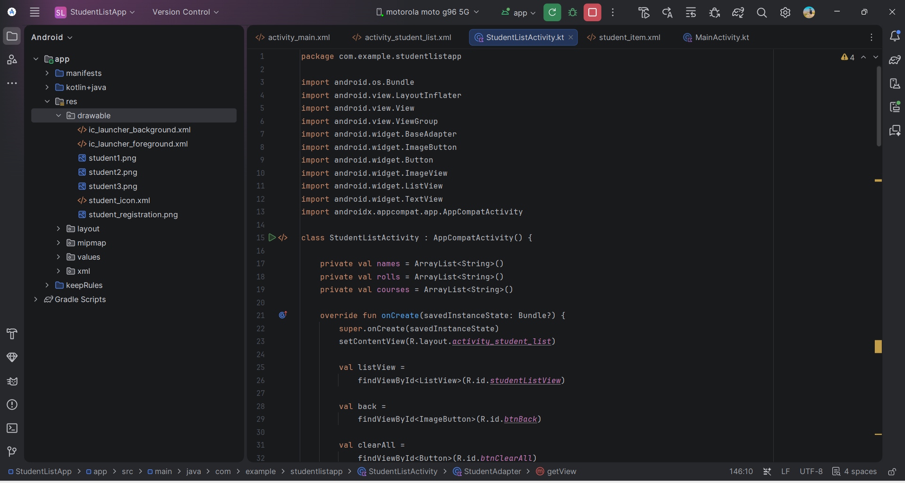

# Student List App

## 1. Project Title
**Student List App – Student Registration and Display Application**

## 2. Aim
To develop an Android application that allows users to register student details and display registered students using ListView and ImageView.

## 3. Scenario
A college needs a simple Android application to register student information and display the registered students in a list. The application provides a registration screen where student details can be entered and a student list screen where registered students are displayed along with their images.

## 4. Objectives
- To create a student registration screen.
- To accept student details from the user.
- To display registered students using ListView.
- To display student images using ImageView.
- To navigate between Activities using Intent.
- To understand Android layouts, Activities and UI components.

## 5. Technologies Used
- Android Studio
- Kotlin
- XML
- Android SDK
- ListView
- ImageView
- Intent
- Git
- GitHub

## 6. Concepts Used

### ListView
ListView is an Android UI component used to display multiple items in a vertical scrolling list. In this project, it is used to display registered student information.

### ImageView
ImageView is used to display student images in the application.

### Activity
An Activity represents a screen of an Android application. This project uses Activities for student registration and displaying the student list.

### Intent
Intent is used to navigate from one Activity to another Activity and pass information between Activities.

### XML Layout
XML is used to design the user interface of the Android application.

## 7. Application Features
- Student registration
- Student details input
- Student list display
- Student images
- ListView implementation
- ImageView implementation
- Activity navigation
- Simple and user-friendly interface
- 
**Important:** There should be **3 backticks before `## 11. Test Cases`**.

Then make sure your screenshot section is exactly like this:

```markdown
## 12. Output

The application successfully registers student details and displays the registered students using ListView and ImageView.

## 13. Screenshots

### Student Registration Screen


### Registered Students Screen


### MainActivity Code


### StudentListActivity Code


## 8. Procedure
1. Create a new Android Studio project.
2. Design the student registration screen using XML.
3. Add the required input fields and buttons.
4. Create the StudentListActivity.
5. Design the student list layout.
6. Add student images to the drawable folder.
7. Implement ListView to display student details.
8. Use ImageView to display student images.
9. Use Intent for Activity navigation.
10. Run the application on an emulator or Android device.
11. Test the application using different student details.
12. Upload the project and screenshots to GitHub.

## 9. Algorithm / Steps
1. Start the application.
2. Display the student registration screen.
3. Enter the required student details.
4. Click the registration button.
5. Store/pass the entered student information.
6. Navigate to the student list screen.
7. Display the student details using ListView.
8. Display the student image using ImageView.
9. Verify the displayed information.
10. Stop the application.

## 10. Folder and File Structure

```text
StudentListApp/
│
├── .idea/
│
├── app/
│   └── src/
│       ├── androidTest/
│       │
│       ├── main/
│       │   ├── java/
│       │   │   └── com/example/studentlistapp/
│       │   │       ├── MainActivity.kt
│       │   │       └── StudentListActivity.kt
│       │   │
│       │   ├── res/
│       │   │   ├── drawable/
│       │   │   │   ├── student1.png
│       │   │   │   ├── student2.png
│       │   │   │   ├── student3.png
│       │   │   │   ├── student_icon.xml
│       │   │   │   └── student_registration.png
│       │   │   │
│       │   │   ├── layout/
│       │   │   │   ├── activity_main.xml
│       │   │   │   ├── activity_student_list.xml
│       │   │   │   └── student_item.xml
│       │   │   │
│       │   │   ├── mipmap-anydpi-v26/
│       │   │   ├── mipmap-hdpi/
│       │   │   ├── mipmap-mdpi/
│       │   │   ├── mipmap-xhdpi/
│       │   │   ├── mipmap-xxhdpi/
│       │   │   ├── mipmap-xxxhdpi/
│       │   │   └── values/
│       │   │
│       │   └── AndroidManifest.xml
│       │
│       └── test/
│
├── gradle/
│
├── Screenshots/
│   ├── 01_Student_Registration_Screen.png
│   ├── 02_Registered_Students_Screen.png
│   ├── 03_MainActivity_Code.png
│   └── 04_StudentListActivity_Code.png
│
├── .gitignore
├── build.gradle.kts
├── gradle.properties
├── gradlew
├── gradlew.bat
├── settings.gradle.kts
└── README.md
